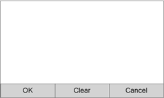

# STU SDK - Getting Started 


## Download the SDK

Download the SDK from https://developer.wacom.com/developer-dashboard

* Login using your Wacom ID
* Select **Downloads for Wacom Device Kit**
* Download **STU SDK for Windows Desktop** and/or **STU SDK for Linux**
* Accept the End User License Agreement to use the SDK

The downloaded Zip file contains the SDK with documentation.


## SDK license

The SDK is free of charge and does not need a license.

## Using the SDK

### Windows
Run the STU-SDK MSI installer to install the components and samples.

Each language has its own sample code and programming reference.
Having installed the SDK you will find separate Doc folders containing the full API reference, see index.html for each language:
•	C
•	COM
•	CPP
The SDK includes binaries for 32-bit and 64-bit windows.
The installer registers the 32-bit COM component wgssSTU.dll for immediate use in the sample code.

### Linux
•	Ensure you have the dependencies installed. This should include: libusb-1.0 and libusb-1.0-devel. 
•	We have currently tested only on fedora16 i686. 
•	Allow user-access to your STU tablet. This usually requires adding a udev rule, for example:
```
SUBSYSTEM=="usb", ATTRS{idVendor}=="056a", ATTRS{idProduct}=="00a[0-9|a-f]", MODE="0666", GROUP="users"
```
 
•	NOTE: Remember to install the **libwgssSTU.so**, for example (note paths maybe different):
```
sudo cp libwgssSTU.so.0.0.x /usr/local/lib
sudo /sbin/ldconfig /usr/local/lib
```
 
NOTE: You may need to adjust your LD_LIBRARY_PATH variable as well.

---
##	Signature Capture Basics

A signature capture application will typically follow these steps:

*	Get available devices 
*	Connect device
*	Display user interface image
*	Receive pen data
*	Generate signature image


The steps are outlined below with code based on the C# sample application DemoButtons.
The full sample can be built and run with Visual Studio 2010 or above, including Visual Studio Express. 

###	Get available devices
```
wgssSTU.UsbDevices usbDevices = new wgssSTU.UsbDevices();
if (usbDevices.Count != 0)
{
   wgssSTU.IUsbDevice usbDevice = usbDevices[0]; // select a device
```


Note that a number of USB devices can be connected and one must be selected from the list.
If a serial connection is used, a specific COM port must be selected.

###	Connect device

```
wgssSTU.Tablet m_tablet = new wgssSTU.Tablet();
wgssSTU.ICapability  m_capability  = m_tablet.getCapability();
wgssSTU.IInformation m_information = m_tablet.getInformation();
    ...
wgssSTU.IErrorCode ec = m_tablet.usbConnect(usbDevice, true);
if (ec.value == 0)
 {
    m_capability  = m_tablet.getCapability();
    m_information = m_tablet.getInformation();
    ...
 }
```

If a serial device is connected use the serial connection function, for example:
```
wgssSTU.IErrorCode ec = m_tablet.serialConnect("COM7",true);
if (ec.value == 0)
 {
    m_capability  = m_tablet.getCapability();
    m_information = m_tablet.getInformation();
    ...
 }
```
Having connected the device its properties can be accessed:

Capability includes:
*	screenWidth
*	screenHeight

Information includes:
*	modelName


###	Display user interface image

Create a bitmap image which can be used to guide the user, for example:

```
bitmap = new Bitmap(capability.screenWidth, capability.screenHeight,
         System.Drawing.Imaging.PixelFormat.Format32bppArgb);
Graphics gfx = Graphics.FromImage(bitmap);
gfx.Clear(Color.White);
```



The image will normally contain ‘buttons’ which can be clicked on the STU display. 
In reality the application will detect the pen position and pressure on the STU and respond accordingly to a ‘button’ click.

Determine the image encoding mode for the connected STU model. The mode is dependent on:
*	Mono or colour
*	Colour resolution
*	Usb bulk transfer option

```
// Calculate the encodingMode that will be used to update the image
wgssSTU.ProtocolHelper protocolHelper = new wgssSTU.ProtocolHelper();

ushort idP = m_tablet.getProductId()
wgssSTU.encodingFlag encodingFlag =        
(wgssSTU.encodingFlag)protocolHelper.simulateEncodingFlag(idP, 0);

bool useColor = false;
if ((encodingFlag & (wgssSTU.encodingFlag.EncodingFlag_16bit | 
  wgssSTU.encodingFlag.EncodingFlag_24bit)) != 0)
{
  if (m_tablet.supportsWrite())
    useColor = true;
}
if ((encodingFlag & wgssSTU.encodingFlag.EncodingFlag_24bit) != 0)
{
    m_encodingMode = m_tablet.supportsWrite() ? 
      wgssSTU.encodingMode.EncodingMode_24bit_Bulk :    
      wgssSTU.encodingMode.EncodingMode_24bit;
}
else if ((encodingFlag & wgssSTU.encodingFlag.EncodingFlag_16bit) != 0)
{
    m_encodingMode = m_tablet.supportsWrite() ?
      wgssSTU.encodingMode.EncodingMode_16bit_Bulk : 
      wgssSTU.encodingMode.EncodingMode_16bit;
}
else
{
    // assumes 1bit is available
    m_encodingMode = wgssSTU.encodingMode.EncodingMode_1bit;
}
```
Prepare the bitmap for transfer:
```
System.IO.MemoryStream stream = new System.IO.MemoryStream();
bitmap.Save(stream, System.Drawing.Imaging.ImageFormat.Png);
bitmapData = (byte[])protocolHelper.resizeAndFlatten(stream.ToArray(),
    0, 0, (uint)bitmap.Width, (uint)bitmap.Height,
    m_capability.screenWidth, m_capability.screenHeight,
    (byte)m_encodingMode, wgssSTU.Scale.Scale_Fit, 0, 0);
```
Send the bitmap to the STU display:
```
m_tablet.writeImage((byte)m_encodingMode, bitmapData);
```

### Receive pen data

Add callback functions to receive pen data:
```
m_tablet.onPenData += new 
 wgssSTU.ITabletEvents2_onPenDataEventHandler(onPenData);
  
m_tablet.onGetReportException += new
 wgssSTU.ITabletEvents2_onGetReportExceptionEventHandler(onGetReportException);
```
Enable pen inking on the STU display:
```
M_tablet.setInkingMode(0x01);
```
Receive data as the pen is used on the STU display:
```
void onPenData(wgssSTU.IPenData penData)
{
// Process incoming pen data
```
penData is delivered while the pen is in contact with, or in close proximity to the STU display surface.
The data includes the values:

*	rdy	True if the pen is in proximity with the tablet
*	sw	True if the pen is in contact with the surface
*	P	Pen pressure in tablet units	
*	X	X-coordinate of the pen position in tablet units
*	Y	Y-coordinate of the pen position in tablet units

To use penData the coordinates need to be converted to normalised units, for example:

```
private Point tabletToScreen(wgssSTU.IPenData penData)
  {
  // Screen means LCD screen of the tablet.
  return Point.Round(new PointF(
    (float)penData.x * m_capability.screenWidth / m_capability.tabletMaxX, 
    (float)penData.y * m_capability.screenHeight / m_capability.tabletMaxY));
  }
```
The pen coordinates are examined to detect a ‘button’ click:
```
    int btn = 0; // will be +ve if the pen is over a button.
    {        
      for (int i = 0; i < m_btns.Length; ++i)
      {
        if (m_btns[i].Bounds.Contains(pt))
        {
          btn = i+1;
          break;
        }          
      }
    }
```
The penData values are saved as a list of X/Y/P points which plot the signature:
```
private List<wgssSTU.IPenData> m_penData; // Array of data being stored. 
...
m_penData.Add(penData);
```

### Generate signature image

When the OK button has been clicked the signature can be reconstructed from the saved penData points.
For example in its simplest form:
```
PointF prev = new PointF();
for (int i = 0; i < m_penData.Count; ++i)
  {
    if (m_penData[i].sw != 0)
    {
      if (!isDown)
      {
        isDown = true;
        prev = tabletToClient(m_penData[i]);
      }
      else
      {
        PointF curr = tabletToClient(m_penData[i]);
        gfx.DrawLine(m_penInk, prev, curr);
        prev = curr;
      }
    }
    else
    {
      if (isDown)
      {
        isDown = false;
      }
    }
  }
```
The sample shows the simplest form of drawing a signature.
The image quality can be improved by adding curve smoothing and increasing the width of the line with pressure.

---

## Linux

### Installing the Linux STU-STK on Ubuntu 16.04 LTS

This is a quickstart guide to setting up the Linux STU-SDK on Ubuntu 16.04 LTS.
The steps below were performed on a fresh 64 bit installation of 16.04, and were tested with SDK version v2.10.1 using an STU–530.

### Setting up the SDK:

### Install JDK:
To run the DemoButtons sample you will first need to install the Java JDK.
Run the following command in terminal, entering your password when prompted:
```
sudo apt-get -y install default-jdk
```

### Install libusb development library
Communication to the STU devices in Linux is performed via the libusb framework.
To install the libusb framework, enter the following command in terminal, entering your password when
prompted:
```
sudo apt-get -y install libusb-1.0.0-dev
```

### Install OpenSSL development library
Encyption routines in Linux are implemented using OpenSSL.
To install the OpenSSL development libraries, enter the following command in terminal, entering your password when prompted:
```
sudo apt-get -y install libssl-dev
```

### Setup udev rules
In order to allow connection to the STU device from user space, the udev rules must be configured correctly. 
Enter the following command in terminal to configure the rules, entering your password when prompted:
```
sudo su -
cat <<EOF >> /etc/udev/rules.d/60-stu.rules
SUBSYSTEM=="usb",ATTR{idVendor}=="056a",MODE:="0666"
SUBSYSTEM=="usb_device",ATTR{idVendor}=="056a",MODE:="0666"
EOF
udevadm control --reload-rules
logout
```

You will now need to unplug and re-connect your STU device for the updated rules to take effect.

### Extract the SDK
Finally, you will need to decompress the SDK with the following command in a terminal (this assumes SDK is on desktop):
```
joss@joss-VirtualBox:~$ cd Desktop/
joss@joss-VirtualBox:~/Desktop$ tar -xvjf Wacom-STU-SDK2.10.1.tar.bz2
```
You are now ready to build and run the demo code.

### Building and running DemoButtons in Java
To build the DemoButtons sample, firstly you need to navigate to the DemoButtons directory:
```
joss@joss-VirtualBox:~$ cd Desktop/Wacom-STU-SDK/
joss@joss-VirtualBox:~/Desktop/Wacom-STU-SDK$ cd Java/samples/DemoButtons/
joss@joss-VirtualBox:~/Desktop/Wacom-STU-SDK/Java/samples/DemoButtons$
```

Next, you need to build the java using the javac command. 
As part of the compilation process, you need to specify the location of the wgssSTU.jar file via the cp parameter to javac (this assumes you are in the DemoButtons directory):
```
javac -cp ../../jar/Linux-x86_64/wgssSTU.jar:. DemoButtons.java
```

Once this is built, you will need to run the sample using the java command line, 
specifying the class path for the jar file, and setting the java.library.path parameter to the location of the libwgssSTU.so library. 
assuming you are running the sample from the DemoButtons directory, you can enter the following command:
```
java -cp ../../jar/Linux-x86_64/wgssSTU.jar:. -Djava.library.path=../../jar/Linuxx86_64 DemoButtons
```

If you have an STU device plugged in, you should see at window with ‘GetSignature’ displayed.
Tapping on this button will start the demo buttons signature capture on the STU device, with the capture simultaneously displayed on the Linux screen.

### Building and running the C++ samples
You can build and run the C++ samples in either 32 or 64 bit mode by setting the MACHTYPE parameter to i686 for 32 bit builds, 
or to x86_64 for 64 bit builds.
For example, to build the 64 bit C++ library and samples:
```
joss@joss-VirtualBox:~$ cd Desktop/Wacom-STU-SDK/cpp/build
joss@joss-VirtualBox:~/Desktop/Wacom-STU-SDK/cpp/build$ make MACHTYPE=x86_64 -f
gcc46.mak
```
Once the build has completed, the library and samples are located under Linux/${MACHTYPE}:
```
joss@joss-VirtualBox:~/Desktop/Wacom-STU-SDK/cpp/build$ cd Linux/x86_64/
joss@joss-VirtualBox:~/Desktop/Wacom-STU-SDK/cpp/build/Linux/x86_64$ ls
getUsbDevices i query simpleInterface simpleTablet WacomGSS.a
joss@joss-VirtualBox:~/Desktop/Wacom-STU-SDK/cpp/build/Linux/x86_64$
```
You can then run getUsbDevices (lists connected STUs), simpleInterface (capture basic pen data)
or simpleTablet (capture pen data over an encrypted connection).

---
