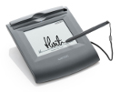
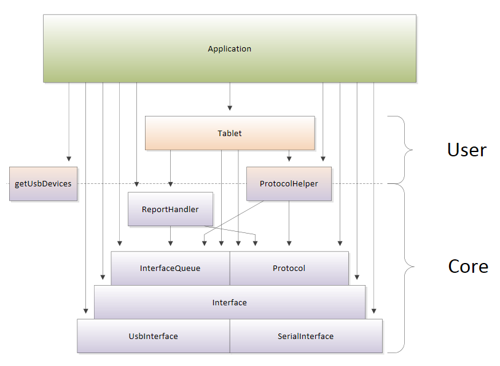

# Wacom Device Kit - STU SDK

## Introduction

The full range of Wacom STU signature pads is supported.
Some of the models have reached the end of their production life but still require software support.
As new models have been introduced additional functionality has been added and this is catered for in the Software Development Kits (SDKs).
The interface specification is not publicly available and instead access to the devices is made through the use of an SDK.

| Model 	| Description | Notes |
|-----------|-------------|-------|
| STU-300 	| Mono 396x100 resolution | (end of production) |
| STU-300b 	| Mono 396x100 resolution | |
| STU-500 	| Mono 640x480 resolution | (end of production) |
| STU-520 	| Colour 800x480 resolution | (end of production)|
| STU-430 	| Mono 320x200 resolution | |
| STU-430V 	| Mono 320x200 resolution  | serial interface|
| STU-530 	| Colour 800x480 resolution | |
| STU-530V 	| Colour 800x480 resolution | serial interface |
| STU-540 	| Colour 800x480 resolution | serial interface, unique ID |
| STU-541 	| Colour 800x480 resolution | TLS encryption, unique ID |

## SDK

Use the SDK to control all aspects of the Wacom STU-series of signature tablets. 

You can: 
* Query the tablet for its current settings and make changes to them.
* Send images to the tablet's LCD screen.
* Receive and decode pen stylus data.

The SDK is written in C++11 and the source code is provided. However there are no limitations if you program in a different language.
C and Java language bindings (Java relies upon JNI) are available with virtually all the same functionality as the core C++.
This is supported on Windows and Linux platforms.
On Windows, there is also a COM library which provides support for any ActiveX-capable language such as .NET Framework (C#) and Delphi. 

##	Which language to use 

### C++ 
The SDK's native language is C++.
This is provided as source code and so can be compiled directly into your program.
Note that the source code requires a number of prerequisites:
* Boost  library
* Windows Driver Kit
* libusb library

Dependencies on external components such as zlib compression and encryption are optional.
These can be pulled in by the developer statically or dynamically according to preference and decisions on third-party licensing models.
The source can be used on all supported platforms; it has been tested with Visual Studio 2010 and GCC 4.6.2. 

### Other languages 
All other language bindings make use of a pre-compiled binary library with a base name of **wgssSTU**.
On Windows this is **wgssSTU.dll**, while on Linux this is **libwgssSTU.so**.
You will need to ensure there is a binary library provided for your target platform. 

####	Java
Support is supplied with a package called **wgssSTU.jar** which uses the binary library to perform the low-level interaction with the hardware.
We have not found a way to safely bundle the binary within the package so the developer is required to keep the files synchronized and run the Java application with the correct settings to locate the binary library. 
It requires a minimum of Java 1.5, with the Tablet class requiring Java 1.7. 

####	C 
The language is supported via a single **wgssSTU.h** header file to the binary library. 
The binary library supports linking statically or dynamically directly with functions or through a function table. 
The interface is a C interpretation of the C++ interface, with C++ exceptions turned back into error codes. 
Although this is a supported language, we would not typically recommend using this language binding due to the potential for programming errors. 

####	COM (ActiveX) 
Support is available on Windows. The binary library can be registered (using regsvr32.exe) or used without registration with an SxS (side-by-side) manifest (especially if developing a new application). 
Registration is required for use with Internet Explorer and during the development of .NET applications (when using Visual Studio), but are not necessary for application execution if deployed with a suitable manifest. 

## Overview 
As far as possible, in each language the classes, interfaces and methods are named identically.
The SDK has been built in discrete layers and you can pick and choose as you prefer.
Generally, all functionality has been made public, including the internal workings so that very fine control can be made if necessary.
Logically, the SDK can be split into simpler User APIs and the low-level Core APIs. 

Note that this SDK is a low-level hardware programming interface, not a user interface and there are no user interface components within the API.
This is one of the key factors which made the API readily ported across languages and platforms. 

The diagram below illustrates the key components within the SDK. 

Although no encryption code is provided, the API is designed with encryption in mind, so that you can add your own routines very easily. 

### User API 
The User API is the highest-level API, providing the simplest interface to interact with the tablet. 

Use the **getUsbDevices()** method to return an array of attached devices, and pass that to the appropriate **connect()** method of class Tablet (you can also connect via a serial port). 

The **Tablet** class is the primary class that you use.
The Tablet class provides basic protection of I/O timings and state-changes within the device as well as against calling functionality that the specific tablet may not have.
This is especially helpful if encryption is used. 

To upload an image, use an appropriate method from within **ProtocolHelper** to prepare the image into the native tablet data format before sending it via your tablet object. 

The exact mechanism for receiving pen data is language dependent but in all but C++, the class automatically queues and decodes the data for you.
In C++ use an **InterfaceQueue** from the tablet object and decode incoming data using class **ReportHandler**. 

If necessary, it is possible to use any of the Core API while using the **Tablet** class. 

### Core API 

Below the **Tablet** class, the **Protocol** and **Interface** classes provide direct access to the workings of the tablet.
This is not generally required, but is not hidden from use if any limitation is found within the higher level API.
No sanity-checking is performed on the input or output data, which is transferred directly as the developer requests it.
 
As per the User API, use the **getUsbDevices()** method to return an array of attached devices, and pass that to the appropriate **connect()** method of **UsbInterface**.
Serial devices can be connected via the **SerialInterface** class. 

Then we recommend you use the **Interface** class which abstracts which type of port the tablet is connected to once the connection has been established.
 
You can then use the **Protocol** class to communicate with the tablet. 
In theory you can even craft your own API packets and send them to the device directly. 
Note that the methods in **Protocol** do not check that the tablet is in a valid state to accept the command, nor does it check whether the operation completed successfully on the device - you must do this yourself. 

For ease of use, there are some helper functions in **ProtocolHelper** that simplify common tasks such as waiting for a command to complete and preparing images to send.
 
To receive pen data, you must get an **InterfaceQueue** object from an **Interface** object. 
This reports incoming raw data, which can then be given to **ReportHandler** to decode. 

---

# Additional resources 

## Sample Code
For further samples check Wacom's Developer additional samples, see [https://github.com/Wacom-Developer](https://github.com/Wacom-Developer)

## Documentation
For further details on using the SDK see [Wacom Device Kit - STU SDK](https://developer-docs.wacom.com/docs/overview/device-kit/stu-sdk/) 

The API Reference is available directly in the downloaded SDK.

## Support
If you experience issues with the technology components, please see the related [FAQs](https://developer-support.wacom.com/hc/en-us)

For further support file a ticket in our **Developer Support Portal** described here: [Request Support](https://developer-support.wacom.com/hc/en-us/requests/new)

## Developer Community 
Join our developer community:

- [LinkedIn - Wacom for Developers](https://www.linkedin.com/company/wacom-for-developers/)
- [Twitter - Wacom for Developers](https://twitter.com/Wacomdevelopers)

## License 
This sample code is licensed under the [MIT License](https://choosealicense.com/licenses/mit/)

---
